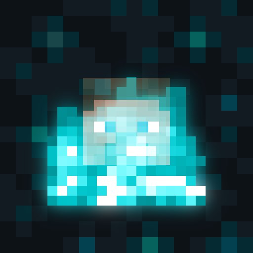

# Death Echoes

Your deaths haunt the world. Every death leaves a ghostly echo — a translucent replay of your final moments, looping forever at the place you fell.

## Features

- **10-second replay loop** — every echo replays the last 10 seconds before your death, forever.
- **Reclaim your XP** — right-click your own echo to get back 50% of the experience you lost.
- **Max 3 echoes per player** — die again and the oldest echo fades away.
- **Glows in the dark** — echoes are visible even at night, so your mistakes are never truly hidden.
- **Works everywhere** — Overworld, Nether, the End, any dimension you (used to) call home.
- **Safe spawn** — echoes never spawn in lava, void, or other instant-death spots.

## How it works

The server continuously records the last 200 ticks (10 seconds) of your movement and pose. The
moment you die, that recording is baked into a persistent echo entity that loops the replay at the
place you fell — a translucent, glowing ghost repeating your final steps for anyone to see.

## Installation

Requires Minecraft **26.1.x (26.1.2+)**.

| Loader | Requirements |
|---|---|
| Fabric | [Fabric Loader](https://fabricmc.net/) + [Fabric API](https://modrinth.com/mod/fabric-api) |
| NeoForge | [NeoForge](https://neoforged.net/) |

Drop the matching jar into your `mods` folder and launch the game.

## FAQ

**Does everyone see my echoes, or just me?**
Everyone on the server sees your echoes. Only you (the owner) can right-click one to reclaim its XP.

**Do echoes despawn on their own?**
No. An echo sticks around until its owner reclaims it — or until it's pushed out by a 4th death.

**Will this tank my server's performance?**
No — at most 3 lightweight, physics-free entities per player are ever active at once.

## Made for Minecraft ModJam 2026 — Echoes of the Past

Death Echoes was built for **Minecraft ModJam 2026**, themed **"Echoes of the Past"**. The theme is
taken literally: every death becomes a literal echo of the past, a looping ghost of who you were
and what you were doing in your last 10 seconds alive, haunting the exact spot where your story
paused.

## Downloads

- CurseForge — (links coming soon)
- Modrinth — (links coming soon)

## License

Released under the [MIT License](LICENSE).

## Credits

Logo and icon composed from official Minecraft textures via ImageMagick (no AI-generated imagery). Screenshots and GIF are unedited gameplay captures.
